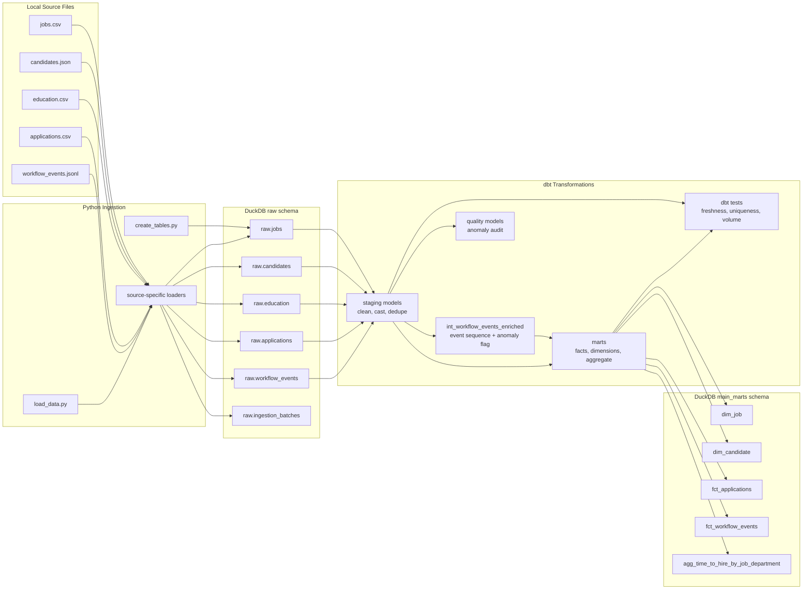
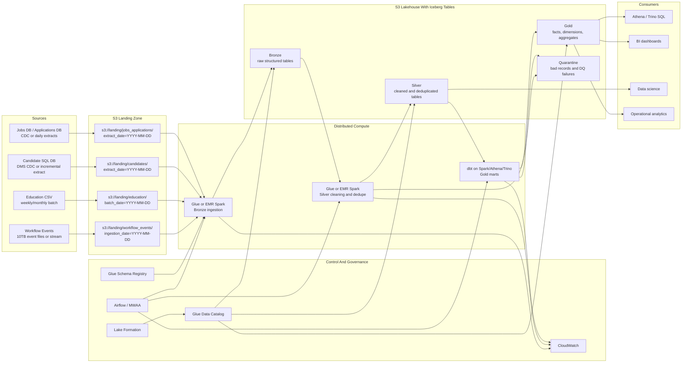
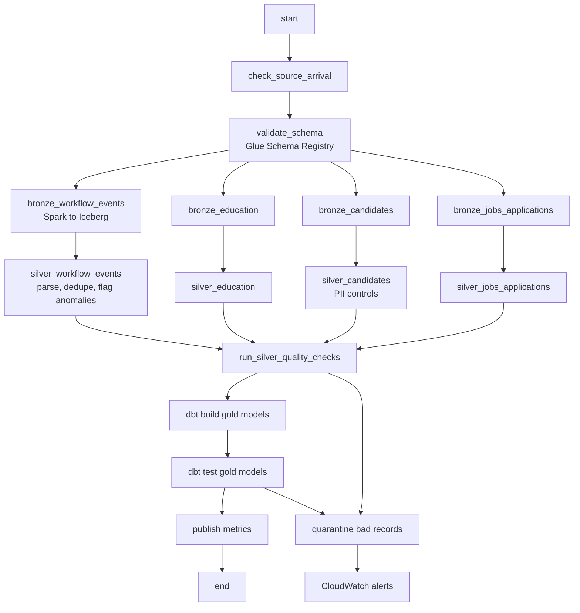

# Architecture

This document explains two versions of the same pipeline:

- Local assignment implementation: Python + DuckDB + dbt
- Production 10TB design: AWS lakehouse with Spark, Iceberg, dbt, Airflow, and governance

The local project is intentionally simple and runnable on a laptop. The production design shows how the same data model and business rules would scale when `workflow_events` becomes a 10TB dataset.

## Local Architecture

### Local Tech Stack

| Layer | Tool | Purpose |
| --- | --- | --- |
| Source storage | Local files under `data/` | Provided assignment datasets |
| Ingestion | Python + pandas + DuckDB | Read CSV/JSON/JSONL, add audit columns, write raw tables |
| Warehouse/query engine | DuckDB | Local analytical database |
| Transformation | dbt-duckdb | Staging, intermediate, marts, tests |
| Data quality | dbt tests + quality model | Uniqueness, not-null, freshness, volume, anomaly checks |
| Unit tests | pytest | Python ingestion helper tests |
| Orchestration | `scripts/run_pipeline.sh` | Local pipeline runner |

### Local Pipeline Diagram



### Local Modeling Notes

- Raw tables preserve source-shaped data and add `_ingestion_ts`, `_ingestion_date`, `_batch_id`, `_file_name`, file checksum, and record hash where applicable.
- Staging models clean values, parse dates, normalize statuses, and deduplicate by business key.
- `int_workflow_events_enriched` recomputes workflow event order for applications impacted by the current run.
- `fct_applications` calculates `hired_date`, `current_status`, `is_hired`, and `time_to_hire_days`.
- `agg_time_to_hire_by_job_department` is a simple full-table reporting aggregate for assignment readability.
- `dq_hired_before_applied_anomalies` persists the known bad records for audit.

## Production Architecture For 10TB Workflow Events

At 10TB, I would not parse JSONL with pandas or load it into one local DuckDB process. I would move ingestion and heavy transformation to a distributed AWS lakehouse while keeping the same logical layers: raw/bronze, cleaned/silver, and analytics/gold.

### Production Tech Stack

| Layer | Technology | Why |
| --- | --- | --- |
| Landing storage | Amazon S3 | Durable, low-cost storage for raw files and CDC extracts |
| Table format | Apache Iceberg on Parquet | ACID writes, schema evolution, partition pruning, time travel, MERGE |
| Distributed processing | AWS Glue Spark or EMR Spark | Parallel parsing and transformation for multi-TB files |
| Catalog | AWS Glue Data Catalog | Central metadata catalog for Iceberg tables |
| Schema registry | AWS Glue Schema Registry | Schema compatibility checks for event data |
| Governance | AWS Lake Formation | Table, column, and row-level permissions, especially for PII |
| Transformation | dbt on Spark/Athena/Trino | SQL modeling, tests, docs, lineage |
| Orchestration | Airflow / MWAA | Scheduling, retries, dependencies, backfills |
| Monitoring | CloudWatch | Job logs, row counts, failures, latency, alerts |
| Data quality | dbt tests plus Anomalo/Monte Carlo/Soda/Great Expectations/Deequ | Deterministic tests plus trend-based anomaly monitoring |
| Query layer | Athena, Trino, Spark SQL, Redshift Spectrum | SQL access to curated Iceberg/Parquet tables |

### Production Pipeline Diagram



### Production Orchestration Diagram



## 10TB Workflow Event Strategy

### Storage Format

Use Apache Iceberg tables backed by Parquet files on S3.

Why:

- JSONL is expensive to parse repeatedly.
- Parquet is columnar and compressed.
- Iceberg supports ACID writes, `MERGE`, schema evolution, hidden partitioning, time travel, and rollback.
- Athena, Spark, Trino, and dbt-compatible engines can query the same open tables.

### Partitioning And Layout

For `workflow_events`, use:

```text
Partition: event_date or ingestion_date
Sort/cluster: application_id, event_timestamp
Target file size: 256MB to 1GB
```

Guidance:

- Use `event_date` when most queries filter by business event time.
- Use `ingestion_date` when late-arriving data and operational replay are more important.
- Do not partition by `application_id`; the cardinality is too high.
- Use compaction to avoid many small files.

### Incremental Processing

Bronze:

- Process new files only.
- Track file path, checksum, batch ID, status, row count, and rejection count.
- Skip already successful batches.
- Reprocess failed/corrected batches with overwrite-by-batch or Iceberg `MERGE`.

Silver:

- Read only new bronze partitions.
- Parse timestamps, normalize statuses, generate deterministic `event_id`.
- Deduplicate by `event_id`.
- Flag hired-before-applied and malformed records.
- Write bad records to quarantine.

Gold:

- Avoid full fact rebuilds.
- Identify impacted `application_id` values from new workflow events.
- Recompute only those application timelines and `time_to_hire_days`.
- `MERGE` impacted rows into `gold.fct_applications` and `gold.fct_workflow_events`.
- Recompute reporting aggregates by impacted job, department, or date partition.

## Data Quality And Anomaly Handling

Data quality should run across layers:

| Layer | Checks |
| --- | --- |
| Bronze | file exists, schema compatible, parseable, row count above zero |
| Silver | required IDs not null, timestamp parseable, accepted statuses, duplicate rate, quarantine malformed records |
| Gold | unique fact/dimension keys, referential integrity, non-negative Time to Hire, anomaly audit |

Hired-before-applied handling:

```text
Bronze: preserve source event
Silver: flag anomaly
Gold fact: exclude from hired_date and time_to_hire_days
Quality/audit: persist anomalous record and alert
```

This is safer than silently dropping the record because the source system may need investigation.

## Governance And PII

Candidate data contains email and phone values.

Production controls:

- Encrypt data at rest with KMS.
- Use Lake Formation for table, column, and row-level access.
- Restrict raw PII tables to data engineering and approved users.
- Expose masked/tokenized candidate views to analytics users.
- Use HMAC/salted hashes for deterministic matching when reversibility is not required.
- Use tokenization or encryption when authorized reverse lookup is required.

## Observability

CloudWatch and Airflow should track:

- source arrival time
- job duration
- rows read and written
- rejected rows
- duplicate rate
- anomaly count
- late-arriving event count
- Iceberg file counts and compaction status
- freshness and SLA misses

Recommended alerts:

- workflow events missing by expected time
- row count changes beyond threshold
- rejected records exceed threshold
- hired-before-applied anomalies spike
- Spark job duration increases sharply
- Iceberg compaction has not run recently

## Interview Summary

For the assignment, I used Python, DuckDB, and dbt because the data is small and the solution needs to be easy to run locally.

For a 10TB workflow event dataset, I would move to an AWS lakehouse. Raw files land in S3, Glue or EMR Spark reads them in parallel, validates schemas, and writes Parquet-backed Iceberg tables registered in Glue Data Catalog. Lake Formation governs access, especially for candidate PII. Airflow orchestrates ingestion, cleaning, dbt gold models, tests, and backfills. CloudWatch monitors job health, row counts, latency, rejected records, and anomalies.

The main scaling principle is to avoid full refreshes: process only new partitions, identify impacted `application_id` values, recompute those timelines, and merge the changed rows into gold facts and aggregates.
