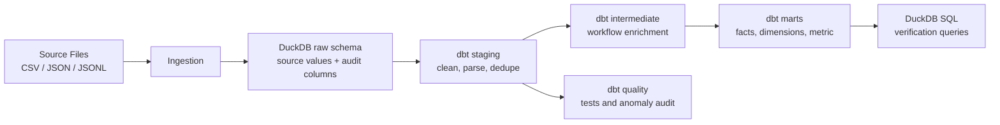

# iCIMS Data Engineering Assignment

This repository contains a local, reproducible data engineering solution for the iCIMS DE assignment.

The implementation uses a simple local stack:

- Python for file ingestion
- DuckDB as the local warehouse and query layer
- dbt for staging, marts, data quality checks, and SQL transformations

The design is intentionally local lightweight and quick setup, while still showing production-oriented patterns: batch audit metadata, idempotent pipeline, raw(bronze)-staging(silver)-marts(gold) layers, anomaly detection, and a written AWS lakehouse design for a large scale (10TB) data volume.

## Where To Read More

| Document | Purpose |
| --- | --- |
| [README.md](README.md) | Main submission guide, setup, commands, and assignment summary |
| [src/ingestion/README.md](src/ingestion/README.md) | Source-specific ingestion assumptions, audit columns, and relevant info |
| [ARCHITECTURE.md](ARCHITECTURE.md) | Local and production architecture diagrams, including large scale AWS lakehouse design |
| [analysis/source_data_analysis.ipynb](analysis/source_data_analysis.ipynb) | Reproducible pandas source analysis notebook |
| [dbt/icims_project/assignment_sql/task1_answers.sql](dbt/icims_project/assignment_sql/task1_answers.sql) | Task 1 SQL answers |
| [dbt/icims_project/assignment_sql/task1_analysis.ipynb](dbt/icims_project/assignment_sql/task1_analysis.ipynb) | Runnable Task 1 validation notebook with expected results |

## Project Structure

```text
.
├── analysis/                         # Source profiling notes and notebook
├── data/                             # Provided source files
├── dbt/icims_project/
│   ├── assignment_sql/               # Task 1 SQL
│   ├── macros/                       # dbt macros and generic code
│   ├── models/
|   |   ├── sources.yml               # Raw data layer (Bronze)
│   │   ├── staging/core/             # Cleaned source models (Silver)
│   │   ├── intermediate/             # Reusable workflow event enrichment (Silver)
│   │   ├── marts/                    # Facts, dimensions, aggregate metric (Gold)
│   │   └── quality/                  # Data quality audit models (Custom DQ Framework)
│   └── tests/                        # dbt unit tests
├── scripts/
│   ├── clean_local_artifacts.sh      # Cleaup resource script for clean setup
│   └── run_pipeline.sh               # E2E pipeline (mimicing Airflow/Orchestrator)
├── src/ingestion/                    # Python raw ingestion modules
├── ARCHITECTURE.md
├── README.md
└── requirements.txt
```

## Data Flow



## Prerequisites

- Python 3.10+
- Git clone or a zip extract of the project
- The provided files under `data/`

## Setup

From the project root:

```bash
python3 -m venv venv
source venv/bin/activate
python3 -m pip install --upgrade pip
python3 -m pip install -r requirements.txt
```

Create a dbt profile if one does not already exist at `~/.dbt/profiles.yml`:

```yaml
icims_project:
  target: dev
  outputs:
    dev:
      type: duckdb
      path: icims.duckdb
      threads: 4
```

## Run The Project

### Option A: One Command

```bash
bash scripts/run_pipeline.sh --date 2026-05-07 --full
```

Use incremental mode after the first full run:

```bash
bash scripts/run_pipeline.sh --date 2026-05-07
```

### Option B: Step By Step

```bash
python3 src/ingestion/create_tables.py
python3 src/ingestion/load_data.py

dbt run --project-dir dbt/icims_project --vars "{run_date: '2026-05-07'}" --full-refresh
dbt source freshness --project-dir dbt/icims_project --vars "{run_date: '2026-05-07'}"
dbt test --project-dir dbt/icims_project --vars "{run_date: '2026-05-07'}"
```

If DuckDB is open in DBeaver or another tool, close that connection before running dbt. DuckDB allows many readers, but only one process can hold the write lock.

## Expected Raw Counts

After a clean load:

| Raw table | Expected rows |
| --- | ---: |
| `raw.jobs` | 500 |
| `raw.candidates` | 2001 |
| `raw.education` | 2000 |
| `raw.applications` | 5000 |
| `raw.workflow_events` | 16769 |

## Implemented Models

Staging:

- `stg_jobs`
- `stg_candidates`
- `stg_educations`
- `stg_applications`
- `stg_workflow_events`

Intermediate:

- `int_workflow_events_enriched`

Marts:

- `dim_job`
- `dim_candidate`
- `fct_applications`
- `fct_workflow_events`
- `agg_time_to_hire_by_job_department`

Quality:

- `dq_hired_before_applied_anomalies`

## Assignment Summary

### Task 1: SQL Analysis

SQL answers are in [task1_answers.sql](dbt/icims_project/assignment_sql/task1_answers.sql). A runnable validation notebook with expected results is available at [task1_analysis.ipynb](dbt/icims_project/assignment_sql/task1_analysis.ipynb).

Current results from the provided data:

| Question | Result |
| --- | --- |
| Currently open jobs | 178 |
| Candidates who applied to more than 3 jobs | 506 |
| Top department by applications | Marketing, 923 applications |

### Task 2: Star Schema And Time To Hire

I chose the dbt + DuckDB path because it clearly demonstrates warehouse-style modeling in a local, easy-to-run project.

Time to Hire is calculated in `fct_applications`:

```sql
DATE_DIFF('day', apply_date, hired_date)
```

`hired_date` is the first valid `HIRED` workflow event after the application date. Hired-before-applied anomalies are flagged and excluded from the metric.

The reporting aggregate is:

- `agg_time_to_hire_by_job_department`

It is intentionally materialized as a simple table for readability in the local assignment. At production scale, this aggregate would be updated incrementally by impacted jobs or partitions.

### Task 3: Engineering, Quality, Scaling, Tests

Idempotency:

- Raw ingestion uses file checksums, deterministic batch IDs, and `raw.ingestion_batches`.
- Rerunning the same source files does not duplicate raw rows.
- dbt staging models handle within-batch deduplication, while downstream dimensional models use merge/upsert semantics on business keys to support idempotent incremental processing at scale.
- dbt marts use incremental computation for fact and aggregates.

Data quality and tests:

- dbt source freshness checks
- dbt uniqueness, not-null, accepted-values, and relationship tests
- custom row-count volume checks through `row_count_between`
- custom email/date tests
- hired-before-applied anomaly warning test
- persisted anomaly audit model: `dq_hired_before_applied_anomalies`
    - Business anomaly:
        - 1 `Hired` event occurs before its application date.
        - Application ID: `2391ab47-f15a-4799-a890-64e2deac7190`
        - `event_timestamp`: `2025-11-08T00:00:00`
        - `apply_date`: `2025-11-13`


10TB scaling:

- Local demo: Python + DuckDB + dbt
- Production design: S3 + Glue/EMR Spark + Apache Iceberg + Glue Catalog + Lake Formation + dbt + Airflow + CloudWatch
- Full design and diagrams are in [ARCHITECTURE.md](ARCHITECTURE.md)

## Useful Commands

Clean generated local artifacts:

```bash
bash scripts/clean_local_artifacts.sh --dry-run
bash scripts/clean_local_artifacts.sh
```

Run only one dbt layer:

```bash
dbt run --project-dir dbt/icims_project --vars "{run_date: '2026-05-07'}" --select tag:stg
dbt run --project-dir dbt/icims_project --vars "{run_date: '2026-05-07'}" --select tag:fact
dbt run --project-dir dbt/icims_project --vars "{run_date: '2026-05-07'}" --select tag:dq
```

Store dbt test failures for debugging:

```bash
dbt test --project-dir dbt/icims_project --vars "{run_date: '2026-05-07'}" --store-failures
```

## Known Trade-Offs

- DuckDB is used for local reproducibility; production multi-TB event processing should use distributed compute.
- Dimensions are SCD Type 1 for assignment simplicity; SCD Type 2 would be added where history is analytically required.
- Candidate PII is kept locally for inspection and also hashed; production should use encryption, tokenization, masking, and Lake Formation controls.
- dbt tests cover deterministic checks; production should add operational monitoring such as Anomalo.