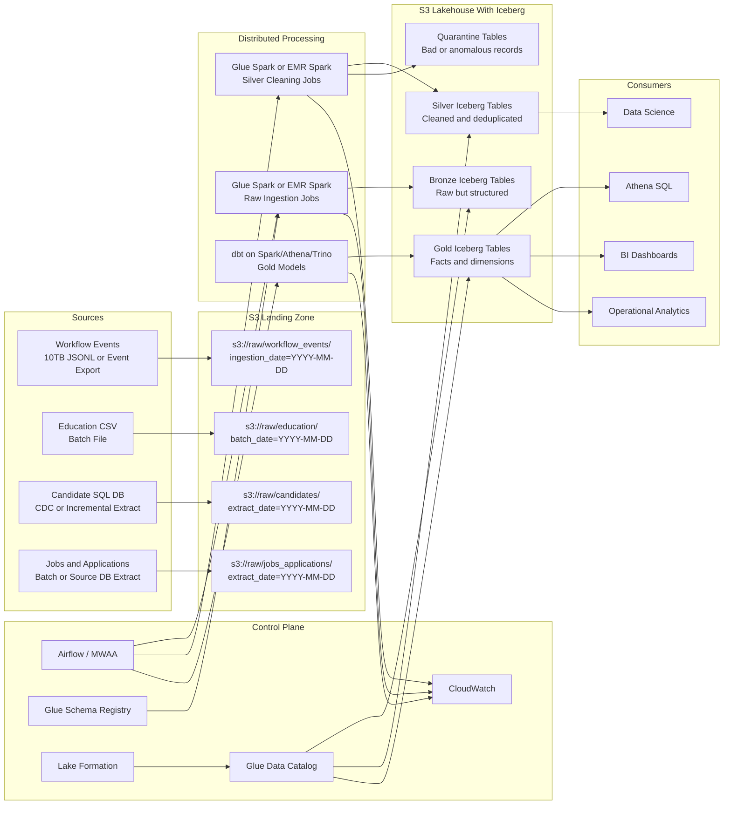
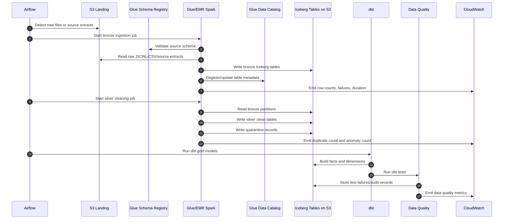
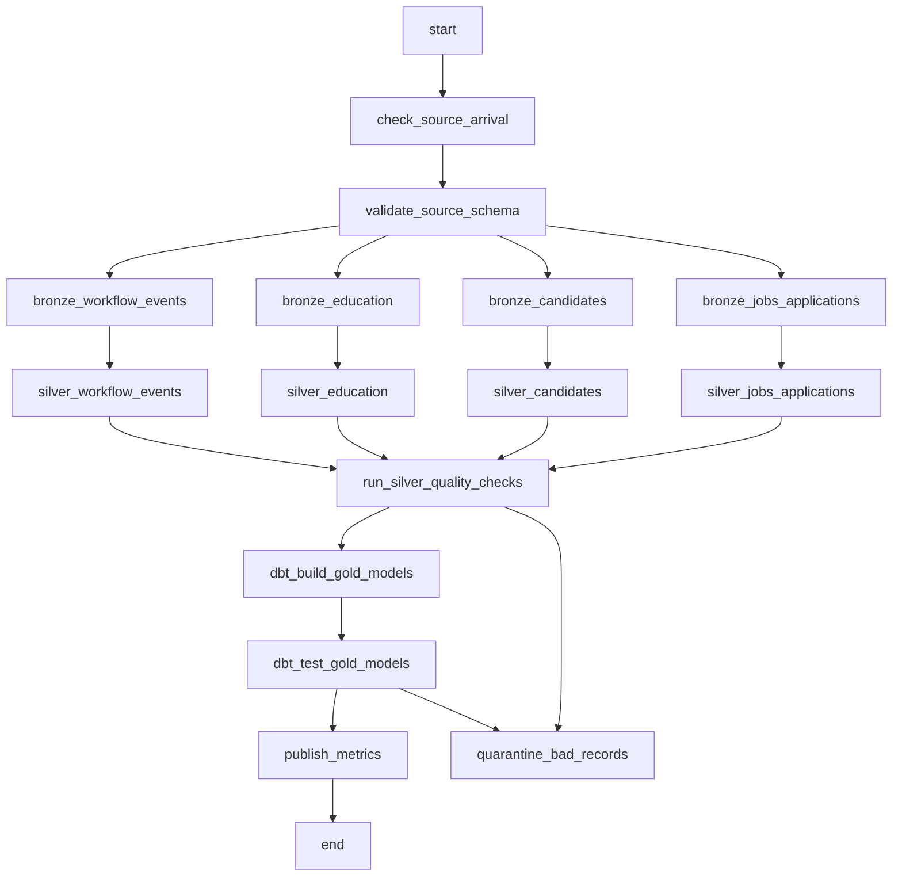

# 10TB Workflow Events Scaling Architecture

This document explains how I would scale the assignment pipeline if `workflow_events` were a 10TB dataset instead of a local JSONL file.

The local assignment uses Python, DuckDB, and dbt because the data is small enough to run on a laptop. At 10TB, the design changes: ingestion, storage, transformation, governance, and observability need distributed systems.

The target platform here is AWS, using a lakehouse architecture.

## Goals

- Ingest large workflow event files and source-system data reliably.
- Convert raw JSON/CSV/source data into an open analytical format.
- Support incremental processing instead of full reloads.
- Preserve raw history for audit and replay.
- Detect data quality issues such as hired-before-applied events.
- Govern access to sensitive candidate data.
- Make curated data queryable by dbt, Athena, Spark, and BI tools.

## Chosen Stack

| Layer | Technology | Why |
| --- | --- | --- |
| Object storage | Amazon S3 | Durable, cheap, scalable storage for raw and curated lakehouse data |
| Table format | Apache Iceberg | ACID writes, schema evolution, partition pruning, time travel, hidden partitioning |
| Distributed processing | AWS Glue Spark or EMR Spark | Parallel processing for multi-TB data |
| Metadata catalog | AWS Glue Data Catalog | Central table catalog for Iceberg tables |
| Schema management | AWS Glue Schema Registry | Track event schemas and prevent incompatible changes |
| Governance | AWS Lake Formation | Table, column, row-level permissions and centralized access control |
| Transformation | dbt | SQL-based modeling, tests, lineage, documentation |
| Orchestration | Apache Airflow, for example MWAA | Scheduling, retries, dependencies, backfills |
| Query layer | Athena, Spark SQL, Trino, Redshift Spectrum | Query curated Iceberg/Parquet tables |
| Monitoring | CloudWatch | Logs, metrics, alarms, pipeline observability |
| Data quality | dbt tests plus optional Great Expectations/Deequ | Technical and business-rule validation |

## High-Level Architecture



## Data Zones

### Landing Zone

The landing zone stores source files exactly as received.

Example paths:

```text
s3://company-lake/raw-landing/workflow_events/ingestion_date=2026-05-07/file_001.jsonl
s3://company-lake/raw-landing/education/batch_date=2026-05-07/education.csv
s3://company-lake/raw-landing/candidates/extract_date=2026-05-07/part-000.parquet
```

Rules:

- Do not mutate landing files.
- Store source metadata such as file name, source system, arrival time, checksum, and batch ID.
- Keep the original data for audit and replay.

### Bronze Zone

Bronze tables are raw but queryable Iceberg tables.

Example tables:

- `bronze.workflow_events`
- `bronze.education`
- `bronze.candidates`
- `bronze.jobs`
- `bronze.applications`

Bronze responsibilities:

- Convert JSON/CSV/source extracts into Parquet-backed Iceberg tables.
- Add ingestion metadata.
- Keep source fields mostly unchanged.
- Capture malformed records in quarantine tables.

### Silver Zone

Silver tables are cleaned, typed, deduplicated tables.

Example tables:

- `silver.workflow_events_clean`
- `silver.education_clean`
- `silver.candidates_clean`
- `silver.jobs_clean`
- `silver.applications_clean`

Silver responsibilities:

- Parse dates and timestamps.
- Normalize statuses, departments, and emails.
- Deduplicate records.
- Validate schema.
- Add workflow event surrogate IDs.
- Flag anomalies.

### Gold Zone

Gold tables are analytics-ready facts and dimensions.

Example tables:

- `gold.fct_applications`
- `gold.fct_workflow_events`
- `gold.dim_job`
- `gold.dim_candidate`

Gold responsibilities:

- Implement business metrics.
- Compute time to hire.
- Join dimensions and facts.
- Expose stable tables for analytics and BI.

## Detailed Pipeline Flow



## Source-Specific Ingestion Design

### Workflow Events: 10TB Event Dataset

This is the largest and most important pipeline.

For a 10TB JSONL file or daily event export:

1. Land files in S3 using a date-based prefix.
2. Run a Glue or EMR Spark job to read files in parallel.
3. Validate the schema using Glue Schema Registry.
4. Convert JSONL to Parquet-backed Iceberg.
5. Partition the table by event date or ingestion date.
6. Deduplicate by event identity.
7. Write malformed records to quarantine.

Example event identity:

```text
event_id = hash(application_id, event_timestamp, old_status, new_status)
```

Why Spark:

- A single machine cannot efficiently parse and transform 10TB JSON.
- Spark splits the data into partitions and processes them across many workers.
- It can write many output files in parallel to S3.

Why convert JSONL to Parquet:

- JSON is row-based and expensive to parse repeatedly.
- Parquet is columnar and compressed.
- Analytical queries usually read only a subset of columns.
- Parquet supports predicate pushdown and statistics.

### Education CSV Batch

Education is a smaller batch source.

Flow:

1. Land the CSV in S3.
2. Read with Glue Spark.
3. Validate required columns.
4. Standardize degree values.
5. Write to `bronze.education`.
6. Clean and dedupe into `silver.education_clean`.

For small files, Glue Python Shell, Lambda, or DuckDB could technically work, but Spark keeps the platform consistent.

### Candidate SQL Database

Candidate data often lives in an operational database.

Recommended ingestion options:

- AWS DMS for full load plus CDC into S3.
- JDBC incremental extract from Spark if the table is small enough.
- Debezium/Kafka/MSK if near-real-time CDC is required.

For interview explanation, AWS DMS is a strong default:

```text
Candidate SQL DB -> AWS DMS -> S3 CDC files -> Spark -> Iceberg
```

Important candidate handling:

- Candidate data may contain PII such as email and phone.
- Use Lake Formation column-level access controls.
- Consider tokenization or masking for non-production consumers.
- Track source update timestamps to build current dimensions or SCD Type 2 history.

### Jobs And Applications

Jobs and applications are medium-sized relational-style datasets.

Flow:

1. Extract from source DB or receive files.
2. Land in S3.
3. Load to bronze Iceberg tables.
4. Clean into silver.
5. Use in gold fact and dimension models.

## Partitioning Strategy

Partitioning is one of the most important lakehouse design decisions.

For `workflow_events`, use:

```text
event_date = date(event_timestamp)
```

or:

```text
ingestion_date = date(_ingestion_ts)
```

Recommended:

- Partition by `event_date` when most queries filter by business event time.
- Partition by `ingestion_date` when late-arriving data is common and operations are batch-arrival oriented.
- In Iceberg, hidden partitioning can transform timestamps into days without exposing physical partition columns to users.

Avoid over-partitioning:

- Do not partition by `application_id`; there may be too many values.
- Instead, sort or cluster by `application_id`.

Good layout:

```text
Partition: event_date
Sort/cluster: application_id, event_timestamp
File size target: 256MB to 1GB
```

## Incremental Processing

At 10TB, full refreshes are expensive. The pipeline should process only new or impacted data.

### Bronze Incremental

Bronze ingestion processes new files only.

Track this in a batch audit table:

```text
batch_id
source_name
file_path
file_checksum
status
started_at
completed_at
rows_loaded
rows_rejected
```

If a batch is rerun:

- Check whether the file checksum already exists.
- If already loaded successfully, skip it.
- If previously failed, retry it.
- If reprocessing is required, delete/overwrite that batch from the target Iceberg table.

### Silver Incremental

Silver processes only changed bronze partitions.

Example:

```text
Read bronze.workflow_events where ingestion_date = current_batch_date
Clean and deduplicate
MERGE into silver.workflow_events_clean
```

### Gold Incremental

Gold tables should recompute impacted business entities, not the whole world.

For time to hire, the impacted key is `application_id`.

If new workflow events arrive:

1. Find affected `application_id` values.
2. Recompute application-level metrics for only those IDs.
3. MERGE into `gold.fct_applications`.

This is much cheaper than recomputing every application.

## Time To Hire At Scale

The business logic remains the same:

```text
time_to_hire_days = hired_date - apply_date
```

But the implementation must be distributed.

Spark/dbt logic:

1. Read `silver.applications_clean`.
2. Read `silver.workflow_events_clean`.
3. Filter workflow events where `new_status = 'HIRED'`.
4. Exclude records where `event_timestamp < apply_date`.
5. Find the first valid hired event per `application_id`.
6. Join to jobs for department-level reporting.
7. Write `gold.fct_applications`.

Pseudo SQL:

```sql
WITH hired_events AS (
    SELECT
        application_id,
        MIN(event_timestamp) AS hired_date
    FROM silver.workflow_events_clean
    WHERE new_status = 'HIRED'
      AND is_anomaly = false
    GROUP BY application_id
)
SELECT
    a.application_id,
    a.job_id,
    a.candidate_id,
    a.apply_date,
    h.hired_date,
    DATE_DIFF('day', a.apply_date, h.hired_date) AS time_to_hire_days
FROM silver.applications_clean a
LEFT JOIN hired_events h
    ON a.application_id = h.application_id;
```

## Data Quality And Anomaly Handling

Data quality runs at multiple stages.

### Bronze Checks

- File exists.
- File can be parsed.
- Required columns exist.
- Schema is compatible with Glue Schema Registry.
- Row count is above zero.

### Silver Checks

- `application_id` is not null.
- `event_timestamp` is parseable.
- `new_status` is in the accepted set.
- Duplicate event rate is within tolerance.
- Malformed records go to quarantine.

### Gold Checks

- `fct_applications.application_id` is unique.
- `dim_job.job_id` is unique.
- `dim_candidate.candidate_id` is unique.
- Time to hire is not negative.
- Hired-before-applied records are flagged and excluded from hire metrics.

Anomaly strategy:

```text
Raw/Bronze: preserve
Silver: flag
Gold metric: exclude from calculation
Audit: store failed records
```

This is better than silently dropping records because the business may need to investigate source-system issues.

## Governance And Security

Candidate data contains sensitive information.

Use Lake Formation for:

- Table-level permissions.
- Column-level permissions for email and phone.
- Row-level filtering if teams should only see certain departments or regions.
- Centralized access control across Athena, Glue, Redshift Spectrum, and EMR integrations.

Recommended access pattern:

| Persona | Access |
| --- | --- |
| Data engineering | Bronze, Silver, Gold |
| Analytics | Gold only |
| BI users | Curated Gold views |
| Data science | Silver and Gold, masked PII |
| Auditors | Raw lineage and test failure tables |

## Observability

CloudWatch should capture:

- Spark job duration.
- Input rows.
- Output rows.
- Rejected rows.
- Duplicate count.
- Anomaly count.
- Data freshness.
- Failed partitions.
- S3 read/write errors.

Airflow should show:

- DAG status.
- Task retries.
- Backfill status.
- Dependency failures.
- SLA misses.

Recommended alerts:

- No workflow events arrived by expected time.
- Row count changed by more than an expected threshold.
- Rejected records exceed threshold.
- Hired-before-applied anomaly count increases.
- Spark job duration increases sharply.
- Iceberg compaction has not run recently.

## Airflow DAG Design



Airflow responsibilities:

- Schedule the pipeline.
- Check whether files or CDC data arrived.
- Start Glue/EMR jobs.
- Run dbt.
- Retry failed tasks.
- Support backfills.
- Publish operational metrics.

## dbt Role In This Architecture

dbt should be used for SQL transformations and tests, not raw 10TB JSON parsing.

Good dbt responsibilities:

- Build silver-to-gold models.
- Define facts and dimensions.
- Implement time-to-hire logic.
- Implement business-rule tests.
- Generate documentation and lineage.

Less ideal dbt responsibilities:

- Parsing 10TB of raw JSONL directly.
- Complex file-level ingestion.
- Long-running distributed data preparation that is better handled in Spark.

Recommended split:

```text
Spark: raw file parsing, heavy cleaning, deduplication, partitioned writes
dbt: analytics modeling, marts, tests, documentation
```

## Glue Vs EMR Vs Databricks

Since the target stack is AWS, Glue and EMR are natural choices.

### AWS Glue

Good for:

- Serverless Spark.
- Managed jobs.
- Simpler operations.
- Native integration with Glue Catalog.

Trade-off:

- Less control than a tuned EMR cluster.

### Amazon EMR

Good for:

- More control over Spark versions and cluster tuning.
- Long-running or very large workloads.
- Advanced performance tuning.

Trade-off:

- More operational responsibility.

### Databricks

Good for:

- Strong lakehouse developer experience.
- Optimized Spark runtime.
- Collaborative notebooks.
- Mature Delta Lake workflows.

Trade-off:

- Additional platform and cost outside core AWS-native services.

Interview-friendly answer:

```text
I would start with AWS Glue Spark for managed serverless processing.
If the workload becomes very performance-sensitive or needs deep Spark tuning, I would move heavy jobs to EMR or Databricks.
The storage layer remains open using Iceberg/Parquet on S3, so the compute engine can evolve.
```

## Why Iceberg

Iceberg is a good fit because it supports:

- ACID writes on S3.
- Schema evolution.
- Hidden partitioning.
- Partition evolution.
- Time travel.
- Snapshot rollback.
- MERGE INTO for incremental upserts.
- Query interoperability across Spark, Athena, Trino, Flink, and other engines.

This matters for a recruiting event pipeline because workflow data can arrive late, schemas can change, and downstream facts need reliable incremental updates.

## Example Table Design

### `silver.workflow_events_clean`

```text
event_id
application_id
old_status
new_status
event_timestamp
event_date
ingestion_date
source_file
batch_id
is_duplicate
is_anomaly
processed_at
```

Partition:

```text
event_date
```

Sort:

```text
application_id, event_timestamp
```

### `gold.fct_applications`

```text
application_id
job_id
candidate_id
apply_date
hired_date
current_status
is_hired
time_to_hire_days
has_anomaly
updated_at
```

Merge key:

```text
application_id
```

## Interview Explanation Summary

If asked to explain this design in an interview:

```text
For the local assignment I used Python, DuckDB, and dbt because it is simple and reproducible.
For a 10TB workflow event dataset, I would move to an AWS lakehouse.
Raw files land in S3, Glue or EMR Spark reads them in parallel, validates schema through Glue Schema Registry, and writes Parquet-backed Iceberg tables registered in the Glue Data Catalog.
Lake Formation governs access, especially for candidate PII.
The lake is organized into bronze, silver, and gold layers.
Bronze preserves raw structured data, silver cleans and deduplicates it, and gold exposes facts and dimensions.
Airflow orchestrates the full flow and CloudWatch monitors jobs, row counts, anomalies, and failures.
dbt is used for gold-layer transformations, tests, documentation, and lineage.
The key scaling idea is to avoid full refreshes: process only new partitions, identify impacted application IDs, and merge only those records into the final fact tables.
```

